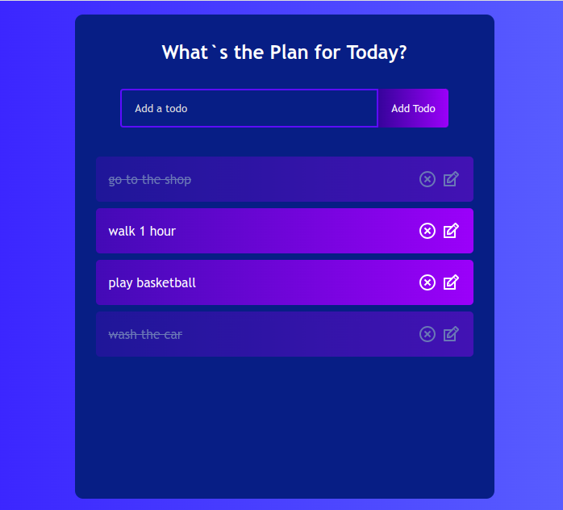

## todo-app 
This is a simple todo app built with React. It allows users to add, edit, complete, and delete todo items.  
Features:  
- Add new todo items
- Edit existing todo items
- Mark todo items as complete
- Delete todo items

## Link and Screenshot  
[Go Live](https://todo-app-deployed.netlify.app/)  

## Installation
Clone this repository:  
git clone https://github.com/bokhuuu/todo-app.git

Install the dependencies:  
npm install

Start the development server:  
npm run dev  
The calculator app will be available at http://localhost:5173. 

## Contributing  
Contributions are welcome! Please feel free to open an issue or submit a pull request if you have any suggestions or improvements.

## Additional Notes  
To use the todo app, simply start by adding a new todo item by entering text into the input field and clicking the "Add todo" button. You can then edit or delete existing todo items by clicking the edit or delete icons next to each item. To mark a todo item as complete, simply click on the item itself.

